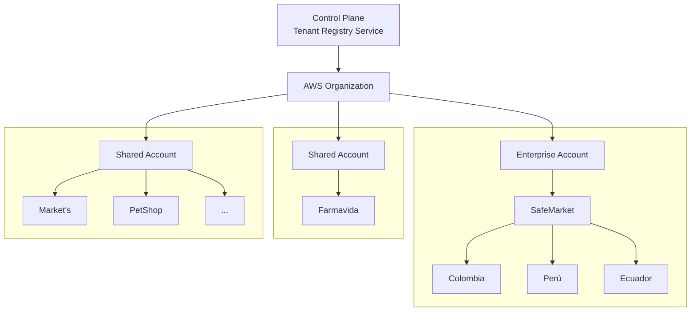

Si buscas en Internet cómo construir un sistema SaaS Multi-Tenant, encontrarás decenas de artículos explicando los conceptos básicos: aislamiento de datos, bases de datos compartidas o dedicadas, estrategias de identificación de tenants y diferentes modelos de despliegue. Son excelentes recursos para comprender la teoría y los patrones más comunes.

Sin embargo, mi experiencia me enseñó que la complejidad real comienza cuando esos conceptos deben aplicarse a un sistema donde cada milisegundo importa.

Durante mi carrera tuve la oportunidad de participar en el diseño y evolución de un **Order Management System (OMS)** bajo un modelo SaaS Multi-Tenant. Por acuerdos de confidencialidad no mencionaré el producto ni la empresa, pero sí compartiré las decisiones de arquitectura, los retos técnicos y las lecciones que considero más valiosas.

Un OMS no es un SaaS convencional. No se limita a almacenar información o ejecutar operaciones administrativas. Su responsabilidad es tomar decisiones de negocio en tiempo real: determinar la disponibilidad de inventario, calcular el mejor método de entrega, aplicar reglas comerciales, validar promociones, estimar costos y tiempos de envío, seleccionar la ubicación adecuada para despachar un pedido y coordinar múltiples procesos que impactan directamente la experiencia del comprador.

Y aquí aparece el verdadero desafío.

El usuario que espera esa respuesta no es únicamente el cliente de la plataforma; en muchos casos es el consumidor final navegando en un e-commerce. Cada consulta debe responderse en cuestión de milisegundos, incluso cuando varias empresas utilizan simultáneamente la misma plataforma y cada una posee reglas de negocio, catálogos, inventarios y volúmenes de tráfico completamente diferentes.

Fue en ese momento cuando comprendí que construir una arquitectura Multi-Tenant no consiste simplemente en agregar un `tenant_id` a las tablas o decidir entre una base de datos compartida o una base de datos por cliente. La verdadera dificultad está en diseñar una arquitectura capaz de escalar, aislar cargas, mantener baja latencia y ofrecer una experiencia consistente para todos los tenants, sin importar su tamaño o demanda.

En este artículo no pretendo explicar qué es una arquitectura Multi-Tenant. En cambio, quiero compartir las decisiones de arquitectura que más impacto tuvieron durante esta experiencia y las lecciones que considero útiles para cualquier arquitecto o ingeniero que esté construyendo una plataforma SaaS de alta demanda.

## ¿Por qué un OMS es un caso tan particular?

Antes de hablar de arquitectura Multi-Tenant, vale la pena entender qué es un **Order Management System (OMS)** y por qué representa un desafío muy diferente al de otros sistemas empresariales.

En términos simples, un OMS es el sistema responsable de administrar el ciclo de vida de una orden de venta, sin importar por qué canal fue generada. Esa orden puede provenir de un e-commerce, una tienda física, un marketplace, un canal de ventas asistidas, una conversación por WhatsApp o cualquier otro punto de contacto con el cliente.

Hasta aquí parece un sistema relativamente sencillo: recibe una orden y la procesa.

La realidad es muy distinta.

Un OMS moderno se convierte en el cerebro operativo de una organización. Antes de permitir una venta debe responder preguntas críticas en cuestión de milisegundos:

* ¿Existe inventario disponible?
* ¿En cuál tienda o centro de distribución?
* ¿Ese inventario realmente puede venderse o está reservado?
* ¿Aplica alguna regla de negocio para ese cliente o canal?
* ¿Cuál es el costo de envío?
* ¿Qué método de entrega puede utilizarse?
* ¿Cuál es el tiempo estimado de entrega?
* ¿Es necesario dividir el pedido entre varias ubicaciones?
* ¿Debe despacharse inmediatamente o esperar reposición?

Cada una de estas respuestas depende de información que cambia constantemente.

Por esta razón, un OMS rara vez trabaja de forma aislada. Generalmente se integra con múltiples plataformas especializadas, como sistemas de inventario, WMS (Warehouse Management System), ERP (Enterprise Resource Planning), PIM (Product Information Management), POS (Point of Sale), plataformas de e-commerce, servicios de facturación, transportadoras y otros componentes del ecosistema tecnológico de una empresa.

Uno de los mejores ejemplos es la gestión de inventario. El OMS recibe continuamente actualizaciones provenientes de diferentes sistemas: movimientos masivos de inventario, ventas, devoluciones, reservas, transferencias entre bodegas y ajustes operativos. Toda esa información debe consolidarse para calcular, en tiempo real, si un producto realmente puede venderse.

Y aquí aparece una complejidad que pocas veces se menciona: **cada empresa administra su operación de manera diferente**.

Algunos clientes trabajan con inventarios de seguridad, otros permiten ventas sobre abastecimiento futuro; algunos manejan transferencias entre tiendas, otros realizan entregas parciales; incluso la forma de calcular la disponibilidad puede cambiar completamente entre dos organizaciones del mismo sector.

Lo mismo ocurre con otros procesos. Hay empresas que necesitan controlar el número de serie o IMEI de cada producto vendido, mientras que otras comercializan artículos donde únicamente importa la cantidad disponible. Algunas integran el cálculo de transportadoras durante la compra y otras prefieren decidir el método de envío después de confirmar la venta. Cada organización posee reglas de negocio particulares que el OMS debe respetar.

Todo esto convierte al OMS en una pieza crítica dentro de la operación. No solo administra órdenes; coordina información proveniente de múltiples sistemas, aplica reglas de negocio específicas para cada cliente y toma decisiones que impactan directamente la experiencia del consumidor final.

Comprender esta complejidad fue fundamental para el diseño de la arquitectura. Porque si construir un SaaS Multi-Tenant ya representa un reto, hacerlo sobre un sistema que debe tomar este tipo de decisiones en tiempo real cambia completamente la forma de pensar la arquitectura.

## La primera gran decisión: ¿qué significa realmente un tenant?

Uno de los conceptos más repetidos cuando se habla de arquitecturas Multi-Tenant es que un *tenant* representa a un cliente dentro de la plataforma. En teoría suena sencillo: múltiples organizaciones comparten una misma aplicación y cada una accede únicamente a su propia información.

Existen diferentes estrategias para lograr este aislamiento. Algunas organizaciones optan por una base de datos completamente independiente para cada cliente (*Database per Tenant*). Otras utilizan una única base de datos con esquemas independientes (*Schema per Tenant*). Y probablemente el modelo más conocido consiste en compartir la misma base de datos utilizando un identificador de tenant en todas las entidades (*Shared Database with Tenant Identifier*).

Cada enfoque tiene ventajas y desventajas en términos de costo, mantenimiento, aislamiento, escalabilidad y operación.

Sin embargo, muy pronto descubrimos que nuestro primer problema no era decidir cuál de estos modelos utilizar. El verdadero reto era responder una pregunta mucho más importante:

**¿Qué representa realmente un tenant dentro de nuestra plataforma?**

En un escenario ideal podríamos decir que un tenant equivale a una empresa. Pero la realidad de los clientes Enterprise es mucho más compleja.

Una organización puede estar conformada por múltiples compañías, operar en diferentes países, administrar varias marcas comerciales, manejar cientos de tiendas físicas, centros de distribución y canales digitales, además de tener procesos completamente diferentes entre una unidad de negocio y otra.

Incluso recursos que parecen evidentes, como el inventario, pueden comportarse de maneras distintas dependiendo del cliente. Algunas empresas comparten inventario entre marcas, otras mantienen inventarios completamente independientes; algunas permiten abastecimiento cruzado entre tiendas mientras otras lo prohíben por políticas internas.

Esto nos llevó a comprender que el modelo de negocio debía ser mucho más flexible que una simple relación **empresa = tenant**.

Pero aún quedaba una decisión mucho más importante.

### ¿Cómo distribuir los costos de la infraestructura?

La teoría sobre Multi-Tenant suele centrarse en el aislamiento de datos, pero rara vez habla del costo de operar una plataforma SaaS.

Imaginemos un microservicio de inventario ejecutándose sobre una base de datos administrada como Amazon Aurora. Si todos los clientes comparten el mismo clúster, ¿cómo distribuir el costo de esa infraestructura?

¿Debe pagar lo mismo un cliente que procesa mil órdenes al día que otro que procesa treinta mil? ¿Qué ocurre cuando un solo tenant consume la mayor parte del CPU, las conexiones, el almacenamiento o las operaciones de lectura y escritura?

Estas preguntas terminaron influyendo mucho más en nuestra arquitectura que la propia estrategia de persistencia.

La decisión que tomamos fue separar ambos conceptos.

Por un lado, utilizamos el concepto tradicional de Multi-Tenant a nivel de aplicación, donde múltiples organizaciones comparten servicios y el aislamiento lógico garantiza la separación de la información.

Pero, por otro lado, introdujimos un nivel adicional de aislamiento en la infraestructura. En lugar de pensar únicamente en tenants lógicos, agrupamos clientes dentro de diferentes cuentas cloud según su tamaño, demanda y necesidades operativas.

En la práctica, esto significa que una cuenta puede alojar un único cliente Enterprise con toda su estructura organizacional, mientras que otra cuenta puede contener múltiples clientes de menor tamaño compartiendo recursos. Dentro de cada cuenta, la aplicación continúa funcionando como una plataforma Multi-Tenant mediante segmentación lógica o, cuando es necesario, utilizando bases de datos dedicadas para determinados servicios.

Esta decisión nos permitió mantener la flexibilidad comercial que busca cualquier SaaS, optimizar los costos de infraestructura y, al mismo tiempo, conservar la posibilidad de escalar de manera independiente cuando un cliente comienza a crecer.

### Separar el multitenancy lógico del multitenancy de infraestructura

Fue en este punto donde tomamos una decisión que, hasta ese momento, no había encontrado documentada de la misma forma en los artículos que había leído sobre arquitecturas Multi-Tenant.

La mayoría de la documentación se enfoca en cómo segmentar la información dentro de la aplicación: una base de datos por cliente, múltiples esquemas o una única base de datos compartida mediante un `tenant_id`. Todas estas estrategias son completamente válidas y resuelven muy bien el aislamiento lógico de la información.

Sin embargo, nosotros decidimos agregar un nivel adicional de aislamiento.

En lugar de pensar únicamente en **cómo separar los datos**, comenzamos a preguntarnos **cómo separar también la infraestructura**.

Nuestra arquitectura quedó dividida en dos niveles claramente diferenciados:

- **Multitenancy lógico**, encargado de aislar la información y las reglas de negocio de cada tenant.
- **Multitenancy de infraestructura**, encargado de decidir dónde vive físicamente cada tenant y qué recursos cloud utilizará.

---

---

Como puede observarse en el diagrama, toda la plataforma parte de una **cuenta principal** cuya responsabilidad no es ejecutar la operación del negocio.

Esta cuenta actúa como el **Control Plane** de la plataforma.

En ella existe un servicio central que llamaré **Tenant Control Plane** encargado de administrar toda la topología del SaaS.

Este servicio conoce, entre otras cosas:

- Qué tenants existen.
- En qué cuenta cloud se encuentra cada uno.
- Qué infraestructura utiliza.
- Qué bases de datos le pertenecen.
- Qué servicios tiene desplegados.
- Su estado operativo.

En otras palabras, es el directorio central de toda la plataforma.

A partir de esta cuenta principal se administran múltiples cuentas cloud independientes. Cada una representa un dominio de infraestructura aislado.

Dependiendo del tamaño y las necesidades del cliente, una cuenta puede albergar diferentes escenarios.

Por ejemplo, un cliente Enterprise puede disponer de una cuenta dedicada donde convivan todas sus compañías, países, marcas o unidades de negocio. Dentro de esa misma cuenta, la aplicación continúa funcionando bajo un modelo Multi-Tenant, segmentando la información de cada compañía mediante mecanismos lógicos.

En cambio, una segunda cuenta puede alojar múltiples clientes pequeños compartiendo la misma infraestructura, permitiendo optimizar costos sin sacrificar el aislamiento de la información.

Cada una de estas cuentas posee su propio ciclo de vida de infraestructura, administrado mediante Terraform. Esto nos permitió desplegar, actualizar o escalar un grupo de clientes sin afectar el resto de la plataforma.

Con esta estrategia conseguimos separar dos problemas completamente distintos.

Por un lado, el aislamiento del negocio, que continúa resolviéndose mediante los patrones clásicos de Multi-Tenant.

Por otro, el aislamiento de infraestructura, que nos permitió distribuir mejor los costos operativos, controlar el crecimiento de los clientes Enterprise y mantener la flexibilidad necesaria para que la plataforma evolucionara sin imponer el mismo modelo de infraestructura para todos los tenants.