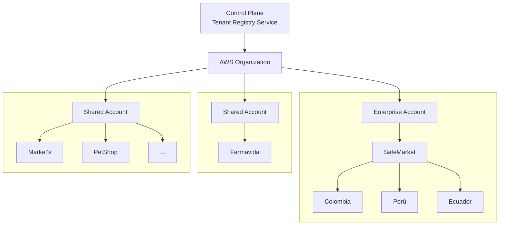

Si buscas en Internet cómo construir un sistema SaaS Multi-Tenant, encontrarás decenas de artículos sobre aislamiento de datos, bases de datos compartidas o dedicadas y estrategias de identificación de tenants. Son buenos recursos para la teoría, pero la complejidad real aparece cuando esos conceptos se aplican a un sistema donde cada milisegundo importa: un Order Management System (OMS) bajo un modelo SaaS Multi-Tenant.

Un OMS no es un SaaS convencional: no solo almacena información, sino que toma decisiones de negocio en tiempo real —disponibilidad de inventario, método de entrega, reglas comerciales, costos y tiempos de envío— que impactan directamente la experiencia del comprador.

Y aquí aparece el verdadero desafío: quien espera esa respuesta muchas veces es el consumidor final navegando en un e-commerce, no solo el cliente de la plataforma. Cada consulta debe resolverse en milisegundos, incluso cuando varias empresas usan la misma plataforma simultáneamente con reglas, catálogos y tráfico completamente distintos.

Construir esta arquitectura no consiste en agregar un tenant_id a las tablas o elegir entre base de datos compartida o por cliente. La verdadera dificultad está en escalar, aislar cargas y mantener baja latencia para todos los tenants — y esas son las decisiones que quiero compartir en este artículo.

## ¿Por qué un OMS es un caso tan particular?

Antes de hablar de arquitectura Multi-Tenant, vale la pena entender qué es un **Order Management System (OMS)** y por qué representa un desafío muy diferente al de otros sistemas empresariales.

En términos simples, un OMS es el sistema responsable de administrar el ciclo de vida de una orden de venta, sin importar por qué canal fue generada. Esa orden puede provenir de un e-commerce, una tienda física, un marketplace, un canal de ventas asistidas, una conversación por WhatsApp o cualquier otro punto de contacto con el cliente.

Hasta aquí parece un sistema relativamente sencillo: recibe una orden y la procesa.

La realidad es muy distinta.

Un OMS moderno se convierte en el cerebro operativo de una organización. Antes de permitir una venta debe responder preguntas críticas en cuestión de milisegundos:

* ¿Existe inventario disponible?
* ¿En cuál tienda o centro de distribución?
* ¿Ese inventario realmente puede venderse o está reservado?
* ¿Aplica alguna regla de negocio para ese cliente o canal?
* ¿Cuál es el costo de envío?
* ¿Qué método de entrega puede utilizarse?
* ¿Cuál es el tiempo estimado de entrega?
* ¿Es necesario dividir el pedido entre varias ubicaciones?
* ¿Debe despacharse inmediatamente o esperar reposición?

Cada una de estas respuestas depende de información que cambia constantemente.

Por esta razón, un OMS rara vez trabaja de forma aislada. Generalmente se integra con múltiples plataformas especializadas, como sistemas de inventario, WMS (Warehouse Management System), ERP (Enterprise Resource Planning), PIM (Product Information Management), POS (Point of Sale), plataformas de e-commerce, servicios de facturación, transportadoras y otros componentes del ecosistema tecnológico de una empresa.

Uno de los mejores ejemplos es la gestión de inventario. El OMS recibe continuamente actualizaciones provenientes de diferentes sistemas: movimientos masivos de inventario, ventas, devoluciones, reservas, transferencias entre bodegas y ajustes operativos. Toda esa información debe consolidarse para calcular, en tiempo real, si un producto realmente puede venderse.

Y aquí aparece una complejidad que pocas veces se menciona: **cada empresa administra su operación de manera diferente**.

Algunos clientes trabajan con inventarios de seguridad, otros permiten ventas sobre abastecimiento futuro; algunos manejan transferencias entre tiendas, otros realizan entregas parciales; incluso la forma de calcular la disponibilidad puede cambiar completamente entre dos organizaciones del mismo sector.

Todo esto convierte al OMS en una pieza crítica dentro de la operación. No solo administra órdenes; coordina información proveniente de múltiples sistemas, aplica reglas de negocio específicas para cada cliente y toma decisiones que impactan directamente la experiencia del consumidor final.

Comprender esta complejidad fue fundamental para el diseño de la arquitectura. Porque si construir un SaaS Multi-Tenant ya representa un reto, hacerlo sobre un sistema que debe tomar este tipo de decisiones en tiempo real cambia completamente la forma de pensar la arquitectura.

## La primera gran decisión: ¿qué significa realmente un tenant?

Uno de los conceptos más repetidos cuando se habla de arquitecturas Multi-Tenant es que un *tenant* representa a un cliente dentro de la plataforma. En teoría suena sencillo: múltiples organizaciones comparten una misma aplicación y cada una accede únicamente a su propia información.

Existen diferentes estrategias para lograr este aislamiento. Algunas organizaciones optan por una base de datos completamente independiente para cada cliente (*Database per Tenant*). Otras utilizan una única base de datos con esquemas independientes (*Schema per Tenant*). Y probablemente el modelo más conocido consiste en compartir la misma base de datos utilizando un identificador de tenant en todas las entidades (*Shared Database with Tenant Identifier*).

Cada enfoque tiene ventajas y desventajas en términos de costo, mantenimiento, aislamiento, escalabilidad y operación.

Sin embargo, muy pronto descubrimos que nuestro primer problema no era decidir cuál de estos modelos utilizar. El verdadero reto era responder una pregunta mucho más importante:

**¿Qué representa realmente un tenant dentro de nuestra plataforma?**

En un escenario ideal podríamos decir que un tenant equivale a una empresa. Pero la realidad de los clientes Enterprise es mucho más compleja.

Una organización puede estar conformada por múltiples compañías, operar en diferentes países, administrar varias marcas comerciales, manejar cientos de tiendas físicas, centros de distribución y canales digitales, además de tener procesos completamente diferentes entre una unidad de negocio y otra.

Incluso recursos que parecen evidentes, como el inventario, pueden comportarse de maneras distintas dependiendo del cliente. Algunas empresas comparten inventario entre marcas, otras mantienen inventarios completamente independientes; algunas permiten abastecimiento cruzado entre tiendas mientras otras lo prohíben por políticas internas.

Esto nos llevó a comprender que el modelo de negocio debía ser mucho más flexible que una simple relación **empresa = tenant**.

> [!KEY]
> Una sola empresa puede representar múltiples compañías, países, marcas y unidades de negocio, cada una con procesos e inventarios completamente distintos. El modelo **empresa = tenant** se rompe muy rápido en contextos Enterprise.

Pero aún quedaba una decisión mucho más importante.

### ¿El tenant solamente representa el negocio?

Hasta este punto pareciera que únicamente debemos preocuparnos por segmentar la información de los clientes.

Pero apareció otra pregunta.

¿Qué ocurre cuando el crecimiento de un tenant también comienza a afectar los costos de infraestructura?

La teoría sobre Multi-Tenant suele centrarse en el aislamiento de datos, pero rara vez habla del costo de operar una plataforma SaaS.

Imaginemos un microservicio de inventario ejecutándose sobre una base de datos administrada como Amazon Aurora. Si todos los clientes comparten el mismo clúster, ¿cómo distribuir el costo de esa infraestructura?

¿Debe pagar lo mismo un cliente que procesa mil órdenes al día que otro que procesa treinta mil? ¿Qué ocurre cuando un solo tenant consume la mayor parte del CPU, las conexiones, el almacenamiento o las operaciones de lectura y escritura?

Estas preguntas terminaron influyendo mucho más en nuestra arquitectura que la propia estrategia de persistencia.

### El nacimiento del tenant de infraestructura

Comprendimos que existían dos tipos de tenant.

El primero representa el negocio.

El segundo representa cómo ese negocio consume infraestructura.

La mayoría de la documentación sobre Multi-Tenant se enfoca en cómo segmentar la información dentro de la aplicación: una base de datos por cliente, múltiples esquemas o una única base de datos compartida mediante un `tenant_id`. Todas estas estrategias son completamente válidas y resuelven muy bien el aislamiento lógico de la información.

Sin embargo, nosotros decidimos agregar un nivel adicional de aislamiento.

En lugar de pensar únicamente en **cómo separar los datos**, comenzamos a preguntarnos **cómo separar también la infraestructura**.

Nuestra arquitectura quedó dividida en dos niveles claramente diferenciados:

> [!KEY]
> **Multitenancy lógico** — aísla la información y las reglas de negocio de cada tenant dentro de la aplicación.
>
> **Multitenancy de infraestructura** — decide dónde vive físicamente cada tenant y qué recursos cloud (cuentas AWS, clústeres, bases de datos) utilizará.

---

---

Como puede observarse en el diagrama, un tenant deja de ser una sola cosa.

Por un lado sigue existiendo el tenant de negocio: la organización, sus marcas, sus países, sus reglas comerciales.

Por otro lado aparece el tenant de infraestructura: la unidad que determina dónde vive ese negocio dentro de la nube, qué recursos consume y cómo se reparten sus costos.

Uno resuelve el aislamiento de la información. El otro resuelve el aislamiento —y el costo— de la infraestructura.

Hasta ese momento pensábamos que el reto consistía en separar correctamente la información de cada cliente.

Sin embargo, la experiencia nos mostró que el verdadero desafío era mucho más amplio.

> [!INSIGHT]
> Un tenant no solamente representa una organización dentro del negocio. También representa una unidad de consumo de infraestructura, costos, capacidad de crecimiento y operación.
>
> Comprender esa diferencia cambió completamente nuestra forma de diseñar la plataforma.

En el siguiente artículo profundizaré en cómo este concepto nos llevó a construir un **Control Plane**, encargado de administrar toda la infraestructura, el ciclo de vida y la distribución de recursos de cada tenant dentro del SaaS.